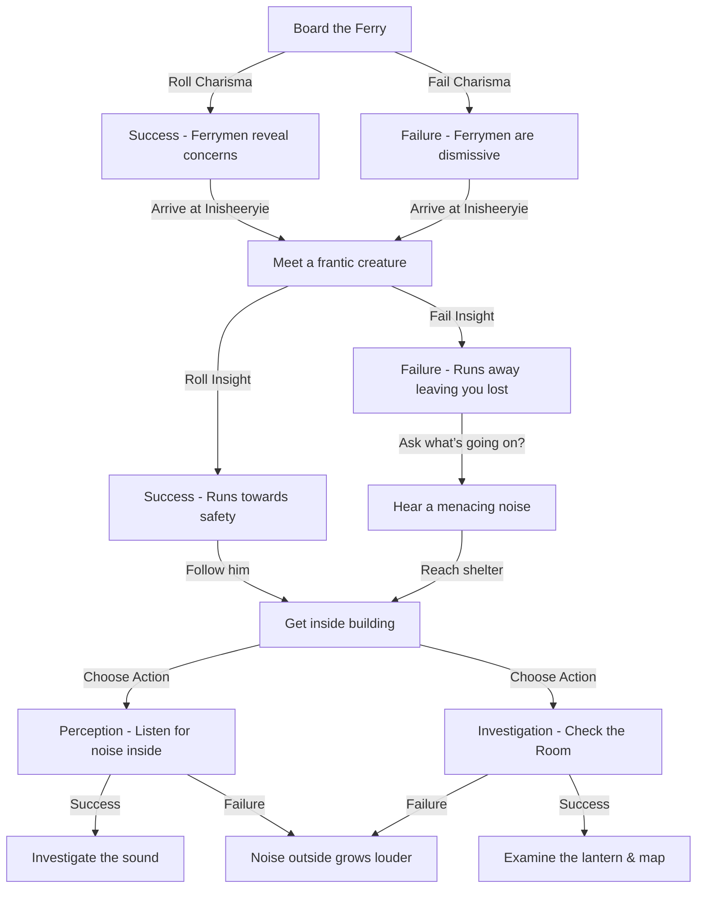

```mermaid
    graph TD;
    0[Board the Ferry] -->|Roll Charisma| 1[Success - Ferrymen reveal concerns]
    0 -->|Fail Charisma| 2[Failure - Ferrymen are dismissive]
    1 -->|Arrive at Inisheeryie| 3[Meet a frantic creature]
    2 -->|Arrive at Inisheeryie| 3[Meet a frantic creature]
    3 -->|Roll Insight| 4[Success - Runs towards safety]
    3 -->|Fail Insight| 5[Failure - Runs away leaving you lost]
    4 -->|Follow him| 7[Hear a menacing noise]
    5 -->|Ask what’s going on?| 6[Hear a menacing noise]
    6 -->|Reach shelter| 7[Get inside building]
    7 -->|Choose Action| 8[Perception - Listen for noise inside]
    7 -->|Choose Action| 9[Investigation - Check the Room]
    8 -->|Success| 11[Investigate the sound]
    8 -->|Failure| 10[Noise outside grows louder]
    9 -->|Success| 12[Examine the lantern & map]
    9 -->|Failure| 10[Noise outside grows louder]
```
