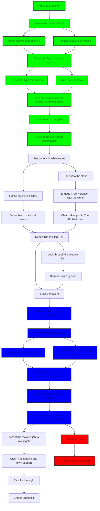

```mermaid
graph TD
    Start[Arrive at Langston] --> PerceptionCheck[Make a Perception Check]
    
    PerceptionCheck --> SuccessNoticeWolves[Notice wolves approaching]
    PerceptionCheck --> FailUnaware[Remain unaware of wolves]
    
    SuccessNoticeWolves --> DecisionWolves[Stand and fight or run for town?]
    FailUnaware --> DecisionWolves
    
    DecisionWolves --> FightWolves[Prepare to fight the wolves]
    DecisionWolves --> RunToTown[Run towards town]
    
    FightWolves --> DruidIntervenes[A Druid intervenes and scares the wolves away]
    RunToTown --> DruidIntervenes
    
    DruidIntervenes --> HeadToLangston[Continue on to Langston]
    
    HeadToLangston --> ArriveMarketplace[Arrive at the eerily quiet marketplace]
    ArriveMarketplace --> EncounterCleric[See a cleric in white robes]
    
    EncounterCleric --> CallOut[Call out to the cleric]
    EncounterCleric --> FollowClericSilently[Follow the cleric silently]
    
    CallOut --> TalkToCleric[Engage in conversation with the cleric]
    FollowClericSilently --> FollowToTavern[Follow her to the local tavern]
    
    TalkToCleric --> ClericGuidesToTavern[Cleric takes you to The Pickled Hen]
    FollowToTavern --> ArriveAtTavern[Reach The Pickled Hen]
    ClericGuidesToTavern --> ArriveAtTavern
    
    ArriveAtTavern --> EnterTavern[Enter the tavern]
    ArriveAtTavern --> PeekInside[Look through the window first]
    
    PeekInside --> BarmaidInteraction[Barmaid invites you in]
    BarmaidInteraction --> EnterTavern
    
    EnterTavern --> FuneralScene[Discover the ongoing funeral inside]
    
    FuneralScene --> DrunkConfrontation[Drunken man confronts you]
    DrunkConfrontation --> PersuasionCheck[Persuade him to back down]
    DrunkConfrontation --> IntimidationCheck[Intimidate him into backing down]
    
    PersuasionCheck --> HalfOrcMayor[Mayor intervenes and takes interest in you]
    IntimidationCheck --> HalfOrcMayor
    
    HalfOrcMayor --> ObserveFuneral[Stay and observe the funeral]
    
    ObserveFuneral --> MayorSpeech[Mayor gives a speech about the town's troubles]
    
    MayorSpeech --> AcceptJob[Accept the mayor’s job to investigate]
    MayorSpeech --> RejectJob[Refuse the job]
    
    AcceptJob --> GivenLodging[Given free lodging and town support]
    RejectJob --> ExpelledFromTown[Forced to leave Langston]
    
    GivenLodging --> GoToSleep[Rest for the night]
    
    GoToSleep --> ChapterEnd[End of Chapter 1]
    
    classDef correct fill:#00FF00,stroke:#444,stroke-width:2px, color:green;
    classDef incorrect fill:#FF0000,stroke:#333,stroke-width:2px, color:darkred;
    classDef bonus fill:#0000FF,stroke:#333,stroke-width:2px, color:darkblue;
    
    class Start,PerceptionCheck,SuccessNoticeWolves,FailUnaware,DecisionWolves,FightWolves,RunToTown,DruidIntervenes,HeadToLangston,ArriveMarketplace correct;
    class RejectJob,ExpelledFromTown incorrect;
    class FuneralScene,DrunkConfrontation,PersuasionCheck,IntimidationCheck,HalfOrcMayor,ObserveFuneral,MayorSpeech bonus;
```

